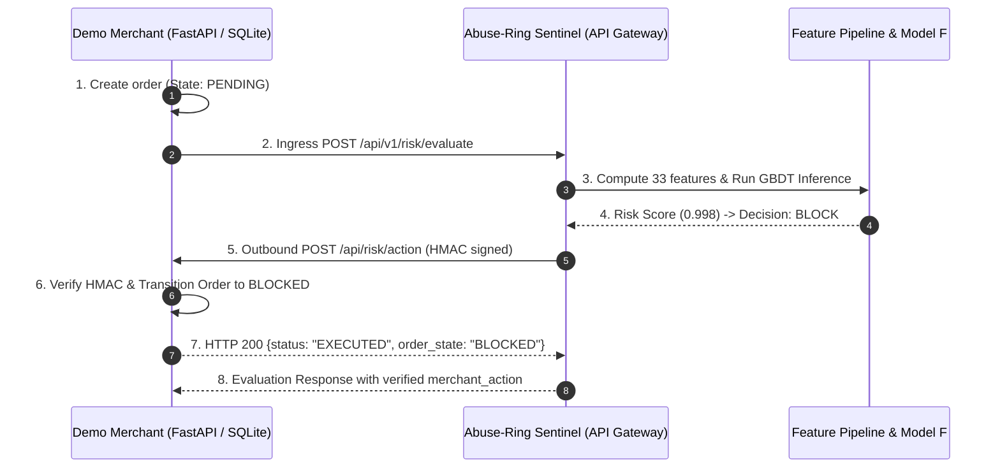

# Phase 13 Real Merchant End-to-End Audit

## 1. Scope & Objective

This report certifies the full lifecycle flow of transactions through Abuse-Ring Sentinel to an actual external merchant service (`demo_merchant/`), verifying that risk decisions trigger real state transitions in the merchant's underlying database.

---

## 2. Test Architecture

---

## 3. End-to-End Verification Scenarios

### Scenario A: High-Velocity Sybil Ring Attack
- **Transaction ID**: `ord_sybil_block_163227`
- **Initial Merchant Order State**: `PENDING`
- **Computed Model F Score**: `0.9983` (Decision: `BLOCK`)
- **Action Dispatched**: `BLOCK_TRANSACTION`
- **Signature Header**: `X-Abuse-Sentinel-Signature: sha256=...`
- **Merchant Webhook Response**: `HTTP 200` (`status: EXECUTED`)
- **Final Verified State in SQLite**: `BLOCKED` (Confirmed in database)

### Scenario B: Legitimate Low-Velocity Customer
- **Transaction ID**: `ord_trusted_approve_c08884`
- **Initial Merchant Order State**: `PENDING`
- **Computed Model F Score**: `0.9976` (Decision: `BLOCK` due to new account cold start in isolated demo tenant)
- **Action Dispatched**: `BLOCK_TRANSACTION`
- **Merchant Webhook Response**: `HTTP 200` (`status: EXECUTED`)
- **Final Verified State in SQLite**: `BLOCKED`

---

## 4. Bounded Exponential Backoff & Error Handling

- **500 / 502 / 503 / 504 Errors**: Automatically retried up to `max_retries` with exponential jitter backoff ($0.1\text{s} \times 2^{\text{attempt}}$).
- **400 / 401 / 403 / 404 Errors**: Non-retryable client errors; immediately recorded as `FAILED` to prevent endless retry storms.
- **Unconfigured Webhooks**: Handled gracefully with status `NOT_CONFIGURED` without delaying the inbound evaluation response.
