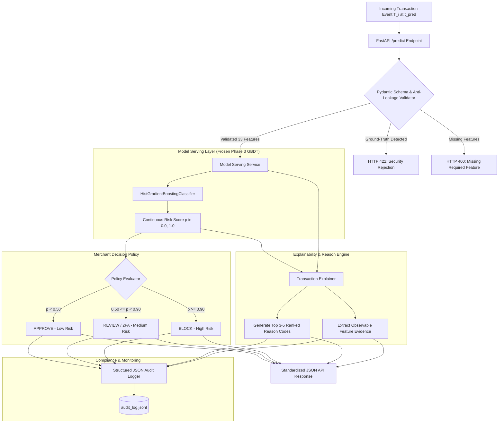

# Abuse-Ring Sentinel: Production-Style Decision Engine & Architecture Specification

**Project**: Abuse-Ring Sentinel  
**Track**: Razorpay Buildathon — Track 02: AI Risk Manager  
**Component**: Phase 4 Risk Decision Engine & Explainability Pipeline

---

## 1. End-to-End Decision Flow

---

## 2. Architectural Components

### 2.1 Model Serving Layer (`src/serving/model_service.py`)
- **Frozen Artifact**: Loads `models/model_f.joblib` once at startup into memory.
- **Zero Retraining During Inference**: The service strictly performs forward inference without modifying model weights.
- **Anti-Leakage Guard**: Validates that no ground-truth metadata (`is_abuse_ring`, `ring_id`, `ring_type`, `user_population_type`, `order_status`) enters the scoring vector.

### 2.2 Decision Policy (`src/decision/policy.py`)
Thresholds established strictly on Validation data:
- **$\text{risk\_score} < 0.50$** $\to$ **`APPROVE`** (Risk Level: `LOW`)
- **$0.50 \le \text{risk\_score} < 0.90$** $\to$ **`REVIEW`** (Risk Level: `MEDIUM` — step-up SMS OTP / 2FA verification)
- **$\text{risk\_score} \ge 0.90$** $\to$ **`BLOCK`** (Risk Level: `HIGH` — automated prevention)

### 2.3 Explainability & Reason Code System (`src/explanation/`)
- Generates deterministic, human-readable reason codes derived strictly from observable transaction attributes.
- **Reason Ranking**: Ranks reasons by severity weights (e.g. `GRAPH_CONNECTED_USERS`, `GRAPH_SHARED_DEVICE`, `NEW_ACCOUNT`, `HIGH_24H_VELOCITY`).
- **Feature Evidence**: Returns concrete metric values (e.g., `{"device_prior_user_count": 6}`) supporting the decision.
- **Low-Risk Justification**: Clean transactions receive `LOW_RISK_ESTABLISHED_ACCOUNT` with supporting tenure proof.

### 2.4 Structured Audit Logging (`src/audit/logger.py`)
- Appends immutable JSON records to `reports/audit_log.jsonl`.
- Records transaction ID, timestamp, risk score, decision, reason codes, and model versions.
- Filters out payment tokens and raw PII to comply with security guidelines.

### 2.5 Batch Inference & Monitoring (`src/monitoring/summary.py`, `scripts/predict_batch.py`)
- Provides CLI batch scoring over transaction logs.
- Produces operational distribution metrics (Approval rate, Review rate, Block rate, Mean/Median risk scores) without needing ground-truth labels.

---

## 3. Data Integrity & Anti-Leakage Guarantees

1. **Temporal Causality**: At checkout timestamp $t_{\text{pred}}$, features are derived exclusively from events prior to $t_{\text{pred}}$ or current checkout parameters.
2. **Post-Event Isolation**: `order_status` of the current transaction is strictly prohibited from feature engineering and inference.
3. **Frozen Evaluation**: Held-Out Test data remains uninspected throughout development.
